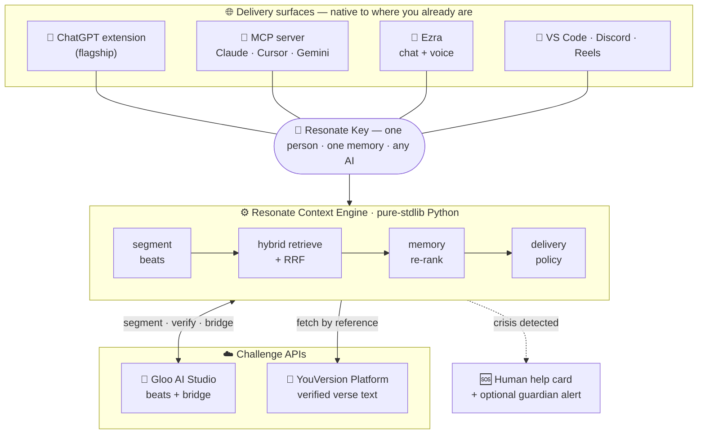
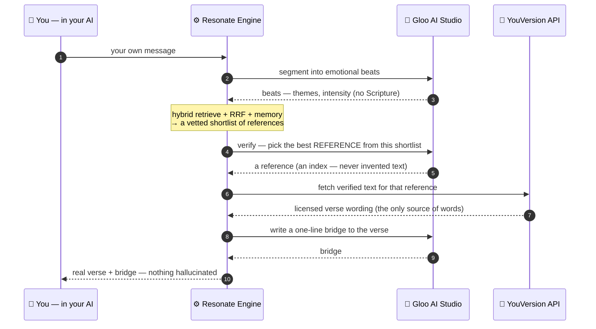
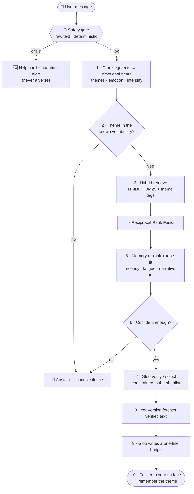

# 📖 Resonate — *Scripture, where you already are*


[](https://resonate-hg6j.onrender.com/)
[](tests/test_resonate.py)
[](eval/run_eval.py)
[](LICENSE)
[](#-reproduce-it-offline--no-keys-no-installs)

> ### ▶️ See it live: **https://resonate-hg6j.onrender.com/**
>
> | | |
> |---|---|
> | 🌐 **Live product** | **[resonate-hg6j.onrender.com](https://resonate-hg6j.onrender.com/)** — running against the real Gloo + YouVersion APIs |
> | 🎬 **3-min film** *(primary)* | _🚧 coming soon — YouTube link goes here_ |
> | 🖥️ **Live walkthrough** | _🚧 coming soon — YouTube link goes here_ |
> | 🔬 **Technical explainer** | _🚧 coming soon — YouTube link goes here_ |

Billions type their most honest words — *grief, burnout, doubt* — into **AI chatbots**, not a Bible app. Scripture has never been present there. **Resonate is the bridge:** it weaves *verified* Scripture into the conversations people already have — quietly, safely, and only when it truly fits.

Built for the Kaggle hackathon **[Scripture in New Frontiers](https://www.kaggle.com/competitions/scripture-in-new-frontiers)** (frontier: *AI & digital assistants*), using the **YouVersion Platform API** and the **Gloo AI Studio API**. MIT-licensed (OSI-approved).

> **Not another Bible app.** You never open anything. The verse appears *inside the tool you're already in* — as a small, dismissible parchment panel — processed locally, storing nothing.

---

## Contents
- [🎯 Aim](#-aim) · [💡 Purpose](#-purpose--the-problem) · [🧭 Approach](#-approach)
- [🧩 The surfaces](#-the-surfaces) · [🏛️ Architecture](#️-architecture)
- [🔄 The context engine between two APIs](#-how-it-works--a-context-engine-between-two-apis)
- [⚙️ The pipeline](#️-the-pipeline-10-stages) · [🔑 The Resonate Key](#-one-brain-across-every-ai--the-resonate-key)
- [🔬 Technical deep-dive](#-technical-deep-dive) · [▶️ Reproduce it](#-reproduce-it-offline--no-keys-no-installs)
- [🌐 Go live](#-go-live-real-apis) · [✅ Verification](#-verification--proof-it-works) · [🗂️ Layout](#️-repository-layout)

---

## 🎯 Aim

**Put the right verse in front of a person at the exact moment their own words are already reaching for it — inside the AI chat they're already using — without ever intruding, storing, or fabricating.**

## 💡 Purpose — the problem

People now bring their inner lives to AI assistants: they type *"I feel like I'm failing everyone,"* *"I can't keep going,"* *"what's the point."* These are the moments Scripture has spoken to for millennia — but in that space, it's simply **absent**. The options today are wrong in both directions:

- **A separate Bible app** — you have to *leave* the moment and go look. Nobody does, mid-conversation.
- **A verse-spamming bot** — recites Scripture at everything, hallucinates wording, and ignores crisis. It annoys, and it can harm.

Resonate exists to be the missing middle: **present where life actually happens, restrained enough to be welcome, and verified enough to be trusted.**

## 🧭 Approach

Four design commitments — each one is enforced in code, not just claimed:

| Principle | What it means | Where it lives |
|---|---|---|
| 🎯 **Native** | The verse appears *inside* your existing AI surface (a panel in ChatGPT, a tool your model calls) — not a destination you visit. | `integrations/` |
| ✅ **Verified** | The model **never recites Scripture**. It proposes a *reference*; **YouVersion supplies the words.** Nothing is hallucinated. | `resonate/engine.py`, `providers/youversion.py` |
| 🤫 **Restrained** | Silent on ordinary messages; speaks only on a real, high-confidence emotional beat; rate-limited; learns from dismissals. | `resonate/policy.py` |
| 🛟 **Safe** | Crisis text is caught on the raw input and routed to a **human-help card — never a verse.** Deterministic, checked first, on every surface. | `providers/gloo.py` (`is_crisis`) |

---

## 🧩 The surfaces

*One engine, many native delivery surfaces — this is the architecture, not a slogan:*

| Surface | What it is | Where |
|---|---|---|
| **🧩 ChatGPT extension** *(flagship)* | a quiet verse beside your AI chat — with voices, "your story", and reels | [`integrations/chatgpt-extension`](integrations/chatgpt-extension) |
| **🔌 MCP server** | Scripture as a native capability for **any** assistant (Claude, ChatGPT, Gemini, Cursor) — stdio locally, or **hosted over HTTP at `/mcp`** so a single URL is the whole install | [`integrations/mcp`](integrations/mcp) |
| **💬 Ezra — the Scripture Guide** | a warm, Bible-rooted companion you can chat or **voice-call**; grounds every answer in real retrieved Scripture | [`web/guide.html`](web/guide.html) · [`resonate/guide.py`](resonate/guide.py) |
| **🎞️ Reels for you** | a Spotify-style shelf of verse-matched story films (real YouVersion partner videos) | [`web/reels.html`](web/reels.html) |
| **📝 VS Code · Discord** | Scripture in the margins where builders think; conversation, not broadcast | [`integrations/vscode`](integrations/vscode) · [`integrations/discord`](integrations/discord) |

---

## 🏛️ Architecture



The engine is **dependency-light** (Python standard library for the core), so it runs fully offline with mock providers, then flips to the live APIs with one config flag. Every surface talks to the **same** engine instance and the **same** per-user memory graph.

---

## 🔄 How it works — a context engine between two APIs

Resonate's contribution is the **context engine** that sits between the two challenge APIs and decides *which* verse, *whether* to speak, and *how* to keep it honest. The division of labor is deliberate — and it's what makes hallucination structurally impossible:

- **🧠 Gloo AI Studio** (faith-aligned LLM) — tags the message's emotional **beats** (grief, perseverance, anxiety…), then **verifies/selects** the best *reference* from a vetted shortlist, and writes the one-line **bridge**. **It never supplies verse wording.**
- **⚙️ The engine** (our code) — hybrid retrieval + Reciprocal Rank Fusion + a temporal memory graph + a restraint policy + a deterministic safety gate.
- **📖 YouVersion Platform API** — the **single source of verse text.** The engine fetches the licensed words *by reference*; those exact words are the only ones a user ever sees.



> **The anti-hallucination boundary** (steps 6–8 above): Gloo is only ever allowed to return a *reference from a fixed list*; YouVersion returns the *words*. The model is never in a position to invent Scripture.

---

## ⚙️ The pipeline (10 stages)

Every message flows through the same stages. Safety is checked **first**, on the raw text, independent of everything else — so a crisis can never be missed or answered with a verse.



Full design rationale: **[ENGINE-DESIGN.md](ENGINE-DESIGN.md)**.

---

## 🔑 One brain across every AI — the Resonate Key

A person is **one individual**, not one account per chatbot. Generate a key on **[/connect.html](https://resonate-hg6j.onrender.com/connect.html)** (e.g. `RSN-7K2P`) and carry it in the hosted URL (`…/mcp?key=RSN-7K2P`), the local `--key` flag, or the browsing prompt. The same key in ChatGPT, Claude, Cursor — on any device — reaches the **same temporal memory graph**, so the recurring-theme insight (*"you've returned to this lately"*) follows the person, not the bot. The extension, the MCP tools, and the web pages all deepen that one graph when they share the key.

---

## 🔬 Technical deep-dive

- **Hybrid retrieval + RRF.** Three independent retrievers — a **TF-IDF** dense vector, **Okapi BM25** (sparse), and **theme-tag** overlap — each rank the 141-verse corpus. Their *ranks* (not raw scores, which need no calibration this way) are merged with **Reciprocal Rank Fusion**. Conversation context echoes into the query so the choice follows the whole conversation, not one line. *(`resonate/retrieval.py`)*
- **Temporal memory graph.** Per-user, it re-ranks by **recency** (don't repeat a verse), **theme-fatigue** (don't hammer one theme), and **narrative arcs** (continuity across sessions) — and surfaces the *"returned to this 4× lately"* moment. Thread-safe; local JSON or Redis backend with automatic fallback. *(`resonate/memory.py`)*
- **Deterministic safety.** Crisis detection is a **phrasing-robust regex** run on the raw text — identical in mock and live, checked before any model call. We deliberately **do not** delegate it to an LLM (a model can refuse, drift, or rate-limit; a missed crisis is the one failure this product must never have). Recall is validated across 14 crisis phrasings, incl. indirect, method-specific, and slang. *(`providers/gloo.py`)*
- **Anti-hallucination by construction.** `verify()` returns an *index into a vetted shortlist*; YouVersion supplies the words. The model is never asked to produce Scripture. *(`resonate/engine.py`)*
- **Grounded conversation (Ezra).** A topic→theme map + hybrid retrieval ground *every* answer in real, fetched Scripture, so the guide leads with a verse instead of interrogating — while wording still comes only from the provider. *(`resonate/guide.py`)*
- **The Gloo alignment trick.** Emotional first-person text sent to a chat completion gets a *pastoral* answer that ignores "return JSON" instructions. We defeat this by framing the input as third-party **data to annotate**, pinning a structured model, and using `response_format: json_object` — a real "push the tool somewhere new" result, backed by runnable code. *(`providers/gloo.py`, `LiveGloo`)*

---

## ▶️ Reproduce it (offline — no keys, no installs)

Requirements: **Python 3.11+** and a Chromium browser. The engine core runs on the **standard library alone** (mock providers + local memory) — clone and run:

```bash
git clone https://github.com/krizz711/resonate && cd resonate
python scripts/demo.py                    # 1 · end-to-end engine demo (creator transcript)
python scripts/policy_demo.py             # 2 · the Delivery Policy staying quiet at the right times
python -m unittest discover -s tests      # 3 · 103 tests (incl. the eval regression guard)
python eval/run_eval.py                   # 4 · 42-scenario evaluation harness
python scripts/serve.py                   # 5 · local engine → http://127.0.0.1:8765
python integrations/mcp/smoke_client.py   # 6 · MCP surface: real stdio session, all 4 tools
```

With the server running, open **http://127.0.0.1:8765** — the homepage and **/connect.html** give the copy-paste MCP block that adds Resonate to Claude, ChatGPT, Gemini or Cursor. For the flagship surface, load `integrations/chatgpt-extension` at `chrome://extensions` → *Developer mode* → *Load unpacked*, then chat on chatgpt.com (verse panel, wax-seal fold, voices, reels). VS Code: open `integrations/vscode`, press **F5**.

**Optional voices** (Kokoro TTS): install [Kokoro-82M](https://github.com/hexgrad/kokoro) in a venv (`pip install kokoro soundfile`), point `RESONATE_KOKORO_PY` at that venv's python, and have `ffmpeg` on PATH — the Listen button then uses **Bella / Isabella / George**; without it, a tuned browser voice is used automatically.

## 🌐 Go live (real APIs)

```bash
cp .env.example .env         # paste GLOO_CLIENT_ID / SECRET + YOUVERSION_APP_KEY
pip install httpx
python scripts/live_check.py # Gloo OAuth → completion → YouVersion catalog
                             # (resolves RESONATE_BIBLE_ID) → passage → engine end-to-end
```

Then set `RESONATE_MODE=live` (or `auto`) and restart `scripts/serve.py`. Accept your Bible's license under **Licensing** on platform.youversion.com first, or passage calls 4xx. Free public hosting via Render — see [docs/CLOUD-DEPLOY.md](docs/CLOUD-DEPLOY.md).

---

## ✅ Verification — *proof it works*

Enforced as a **regression guard in the test suite** (quality can't silently drop):

| Metric | Result |
|---|---|
| Unit tests | **103 passing** |
| Evaluation harness | **42 scenarios** |
| Theme recall | **100%** |
| Verse hit@1 · hit@3 | **96.2% · 100%** |
| Safety recall (14 crisis phrasings) | **100%** |
| Safety false-positive rate | **0%** |

**Live-verified:** the hosted `/health` reports `gloo: live · youversion: live`; a grief query returns real modern-translation wording (`source: youversion`), and crisis input returns a `safety_hold` with no verse. `RESONATE_MODE=auto` uses each provider live when its keys are present and mock otherwise, so the demo never half-breaks.

---

## 🗂️ Repository layout

```
resonate/        engine package — config, models, embeddings, verses, retrieval, memory,
                 policy, engine (orchestrator), guide (Ezra), providers/(gloo, youversion)
integrations/    chatgpt-extension/ · mcp/ · vscode/ · discord/     (delivery surfaces)
web/             engine-served pages: Ezra (guide) · reels · connect · guardians · panel-preview
data/            verses.json (141 refs + tags, no text) · sample_texts.json (KJV demo text)
scripts/         demo.py · policy_demo.py · serve.py · live_check.py · e2e_smoke.py
eval/            dataset.json + run_eval.py (metrics)      tests/  test_resonate.py (103 cases)
docs/            writeup · video script · cover · competitiveness review · cloud-deploy
notebook/        resonate_demo.ipynb  (public Kaggle proof-of-work)
```

## 📦 Submission assets

- 🎬 Video script — [docs/VIDEO-SCRIPT.md](docs/VIDEO-SCRIPT.md)
- 📄 Writeup (≤500 words) — [docs/WRITEUP.md](docs/WRITEUP.md)
- 📓 Public notebook — [notebook/resonate_demo.ipynb](notebook/resonate_demo.ipynb)
- 🖼 Cover image — [docs/cover.svg](docs/cover.svg)
- 🧭 Competitiveness review — [docs/COMPETITIVENESS.md](docs/COMPETITIVENESS.md)
- 🏛️ Engine design — [ENGINE-DESIGN.md](ENGINE-DESIGN.md)

## 📜 License

[MIT](LICENSE) — OSI-approved, per the competition's winning requirements. Scripture text is fetched at runtime from the YouVersion Platform API under its own license terms; no verse text is redistributed in this repository.

---

<div align="center"><i>Resonate makes Scripture present where life actually happens — on the user's terms, never intruding.</i></div>
