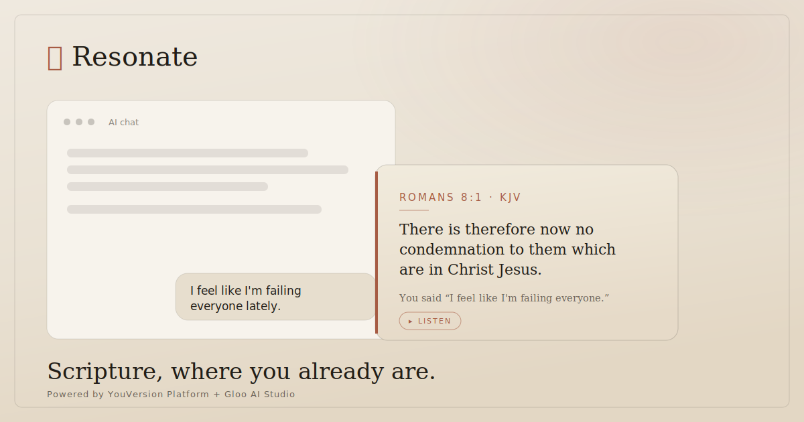

# Resonate — Scripture, where you already are



Billions now type their most honest words — grief, burnout, doubt — into **AI chatbots**, not a
Bible app. Scripture has never been present there. **Resonate** is the bridge: it weaves
*verified* Scripture into the conversations people already have — quietly, safely, and only when
it truly fits.

Built for the Kaggle hackathon **Scripture in New Frontiers** (frontier: *AI & digital
assistants*). Uses the **YouVersion Platform API** + **Gloo AI Studio API**. Submission due
**2026-08-01**.

> **Not another Bible app.** You never open anything. The verse appears inside the tool you're
> already in — as a small, dismissible parchment panel — processed locally, storing nothing.

## The surfaces — *you choose where Scripture meets you*
One engine, many native delivery surfaces (this is the architecture, not a slogan):

| Surface | What it is | Where |
|---|---|---|
| **ChatGPT extension** *(flagship)* | a quiet verse beside your AI chat | [`integrations/chatgpt-extension`](integrations/chatgpt-extension) |
| **VS Code companion** | Scripture in the margins where builders think | [`integrations/vscode`](integrations/vscode) |
| **Discord bot** | Scripture as conversation, not broadcast | [`integrations/discord`](integrations/discord) |

## How it works — a context engine between the two APIs
- **Gloo AI Studio** reads the message → emotional *beats*, writes the one-line *bridge*, runs
  safety. *Never recites Scripture.*
- **The engine** matches each beat with **hybrid retrieval** (dense + BM25 + theme tags fused via
  **Reciprocal Rank Fusion**), re-ranks by tone-fit + a per-user **temporal memory graph**, and a
  **Delivery Policy** decides whether to speak at all.
- **YouVersion Platform API** returns the verified, licensed verse text. The model proposes a
  reference from a vetted shortlist; YouVersion confirms the words — nothing is hallucinated.

Full design: [ENGINE-DESIGN.md](ENGINE-DESIGN.md).

## What makes it native, not a pop-up
1. **Restraint.** Silent on ordinary messages; speaks only on a real, high-confidence beat;
   rate-limited; learns from dismissals. (`resonate/policy.py`)
2. **Safety first.** Crisis text is caught on the raw input and routed to a **human-help card —
   never a verse** (100% recall on the eval set).
3. **Memory over time.** It notices recurring themes — *"you've returned to this 4× lately"* —
   personalization across conversations, not one sentence.
4. **Privacy.** Reads only the user's own message, locally; stores nothing; opt-in per site. An
   optional warm voice can read the verse aloud.

## Quickstart (offline — no keys, no installs)
The engine runs on the Python standard library alone (mock providers + local memory):
```bash
python scripts/demo.py                         # end-to-end engine demo (creator transcript)
python scripts/policy_demo.py                  # the Delivery Policy staying quiet at the right times
python integrations/discord/bot.py --selftest  # the Discord surface, offline
```
Run the local engine server (the browser/editor connectors talk to it):
```bash
python scripts/serve.py     # http://127.0.0.1:8765
```
Then load `integrations/chatgpt-extension` as an unpacked Chrome extension, or open
`integrations/vscode` in VS Code and press F5. To go live later: `cp .env.example .env`, add
keys, set `RESONATE_MODE=live`.

## Verification — *proof it works*
```bash
python -m unittest discover -s tests    # 31 tests
python eval/run_eval.py                 # 32-scenario evaluation harness
```
Current metrics: **theme recall 100% · verse hit@1 96% · hit@3 100% · safety recall 100% ·
false-positive 0%** (enforced as a regression guard in the test suite).

## Submission assets
- 🎬 Video script — [docs/VIDEO-SCRIPT.md](docs/VIDEO-SCRIPT.md)
- 📄 Writeup (≤500 words) — [docs/WRITEUP.md](docs/WRITEUP.md)
- 📓 Public notebook — [notebook/resonate_demo.ipynb](notebook/resonate_demo.ipynb)
- 🖼 Cover image — [docs/cover.svg](docs/cover.svg)
- 🧭 Competitiveness review — [docs/COMPETITIVENESS.md](docs/COMPETITIVENESS.md)

## Layout
```
resonate/        engine package — config, models, embeddings, verses, retrieval,
                 memory, policy, engine (orchestrator), responder, providers/(gloo, youversion)
integrations/    chatgpt-extension/ · vscode/ · discord/   (delivery surfaces)
data/            verses.json (131 refs+tags, no text) · sample_texts.json (KJV demo text)
scripts/         demo.py · policy_demo.py · serve.py (local engine server)
web/             control-panel playground served by the engine
eval/            dataset.json + run_eval.py (metrics)
tests/           test_resonate.py (31 cases incl. the eval guard)
docs/            video script · writeup · cover · competitiveness review
```

## Status
Engine, all three surfaces, restraint, safety, memory, tests + eval — **built and green in mock
mode** (runs anywhere offline). The live Gloo + YouVersion integration flips on with one config
change once challenge keys open (**2026-07-06**).
